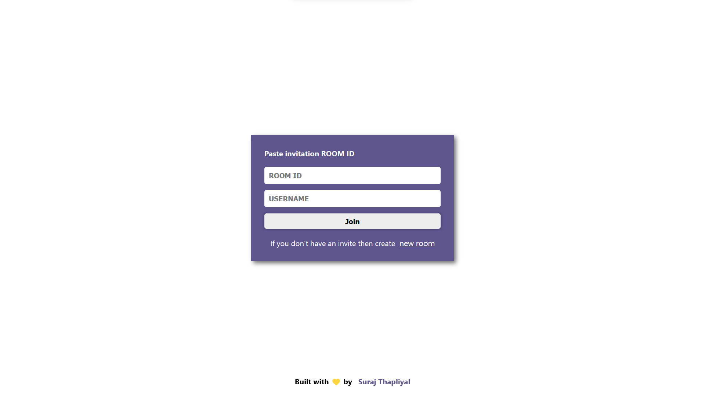
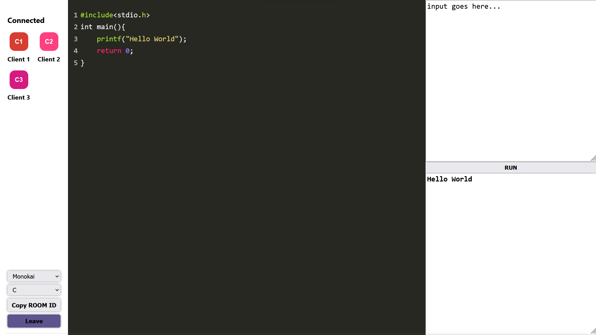
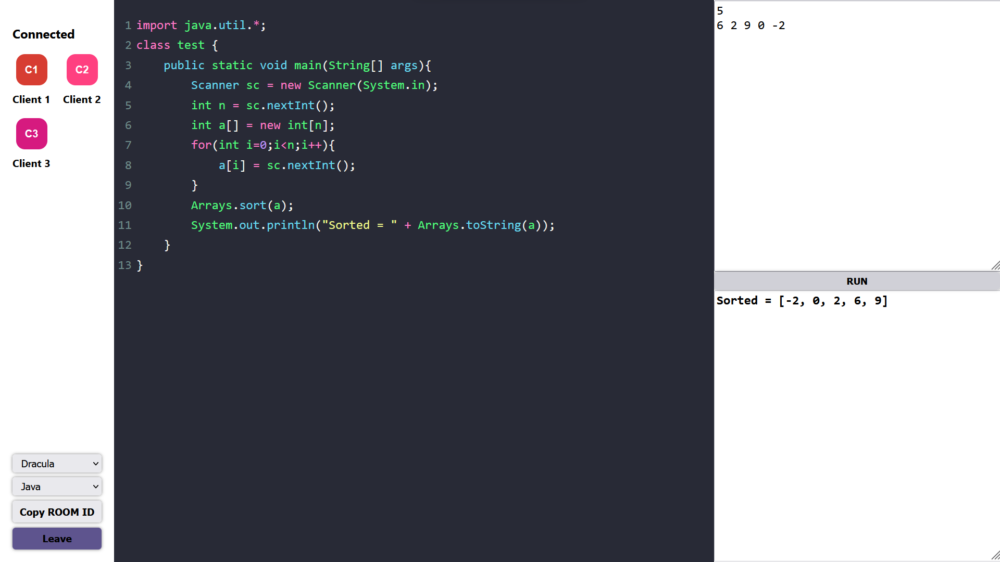
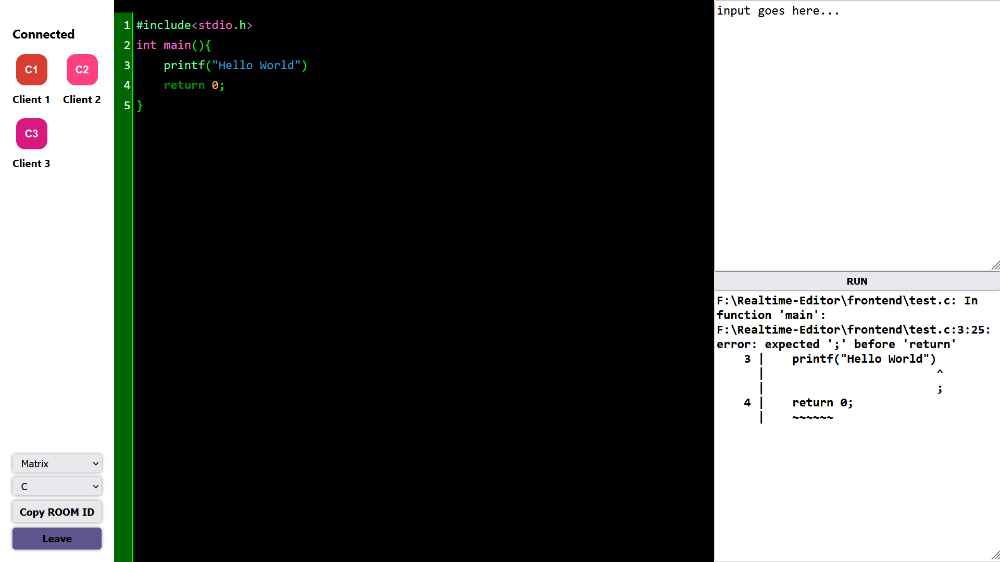

# Realtime Multi-user Code Editor

##### _Built with React Js, Express Js, SocketIO and Codemirror_

A code editor where multiple users can join in a room and code together.
Multiple themes support, multiple languages support with source code compilation.

- 8 themes support
- 3 programming languages support
- Infinite users support

## How to run:

clone in your local system

```sh
git clone (this repository's ssh)
```

Now you should have installed all the required dependencies on your local system :

```sh
npm install
```

To serve frontend:

```sh
npm run start:front
```

To serve backend:

```sh
npm run server:dev
```

Environment Variable:
In this project there is only one env variable which contains the backend url which server requests.
Create a file .env and write:

```sh
REACT_APP_BACKEND_URL:(your backend/localhost url)
```

## Screenshots :

Outlook:


C language code:


Java code:


Errored code:


_Socket.IO cheatsheet link_ : https://stackoverflow.com/questions/32674391/io-emit-vs-socket-emit
